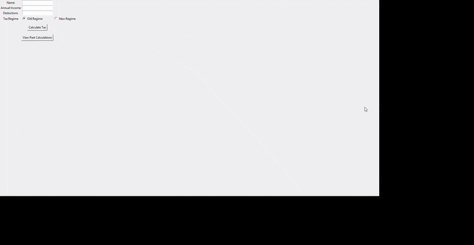
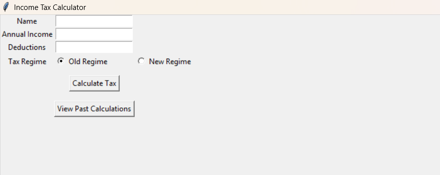
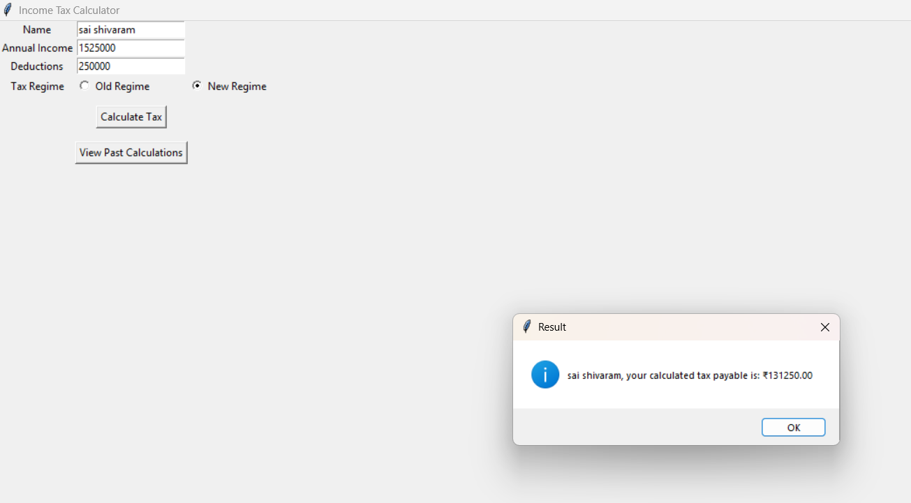
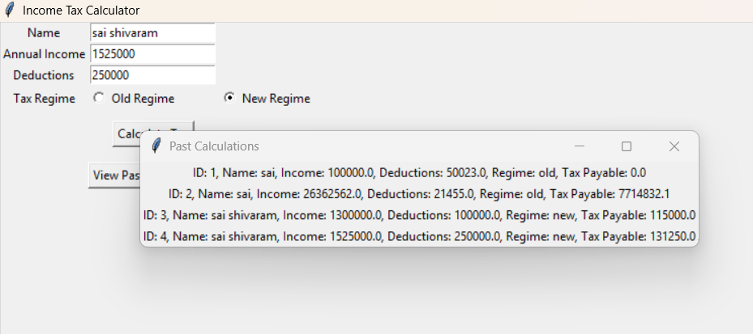

# 🧾 Income Tax Calculator (Tkinter + SQLite)

This project is a GUI-based **Income Tax Calculator** built using Python.  
It calculates the tax payable based on the Indian **Old vs New Regime**, saves the data in SQLite, and lets users view past calculations.

---

## 📹 Demo




---

## 🖼 App Interface

### ➤ Main UI  


### ➤ After Calculation  


### ➤ Past Calculations  


---

## 🚀 Features

- Clean Tkinter interface
- Old & New regime support
- Tax logic based on slabs
- Saves data to SQLite (`tax_calculator.db`)
- View previous tax calculations
- Input validation with pop-up messages

---

## 🛠 Technologies Used

- Python 3
- Tkinter
- SQLite3

---

## 📦 How to Run

```bash
python tax_calculator.py
